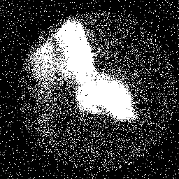

# Segmentation by Maximum Likelihood with k-means Algorithm

1. Compile c code: ```./compilegcc SegmentationMaxLikelihood``` 
2. Run executable file: ```./SegmentationMaxLikelihood your_input_image```
3. Output 2 images: original image, segmentation image
4. Results
<br>


<br>


<br>


